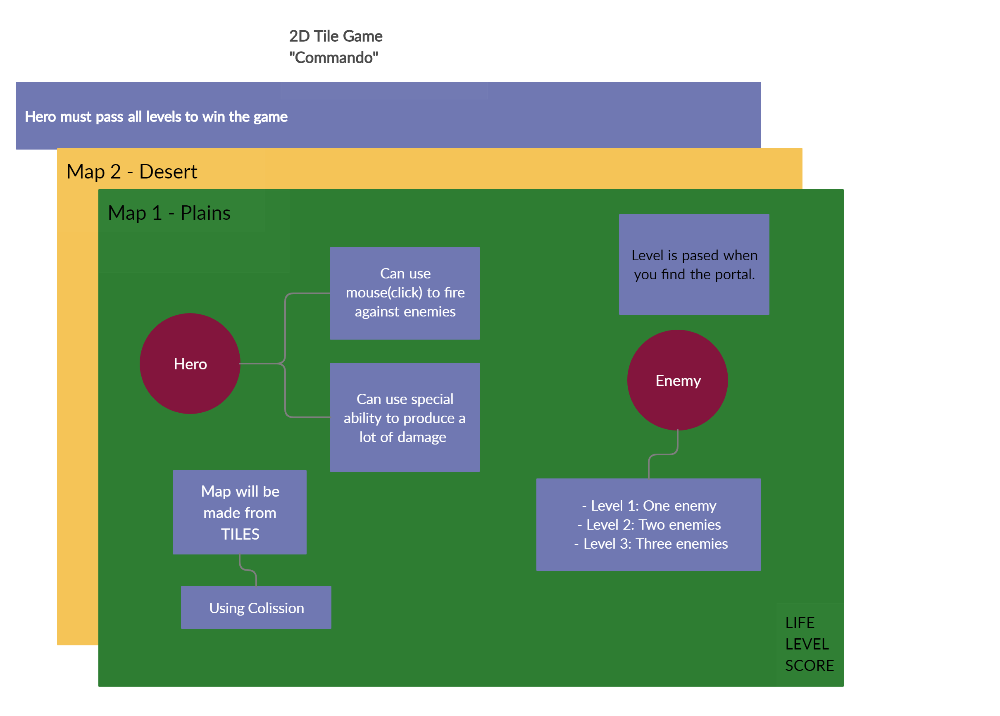
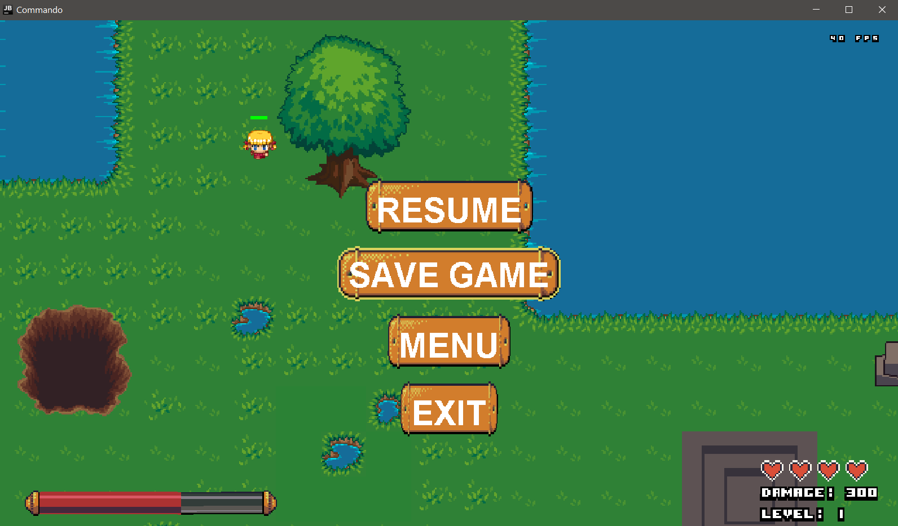

# Commando_2D_Tile_Game

Commando is a top-down game where your goal is to pass all the levels and gather as much damage points as possible. 

You can shoot bullets and use your special ability when near enemies. Everyone will try to stop you but if you are careful and brave you can reach your goal. 

To pass the levels you need to find the portal and stay inside teleportation area for up to 5 second. When you finnish all the levels you will be mentioned in the LeaderBoard. 

Are you up to the challange?

## Setup
	*The game is implemented in java*

 - install java (on windows) [link](https://www.java.com/en/download/help/windows_manual_download.xml)
 - install mysql driver [link](https://jar-download.com/artifacts/org.xerial/sqlite-jdbc/3.8.11.2/source-code)
 - configure classpath for driver: 
 
 
## GamePlay

Other features include: :star:
 
 - Life system, You start with 4 lifes and lose when have 0 left 
 - The map is larger than screen size and a camera is implemented to move around 
 - Enemies will respawn everytime you will kill them 
 - Enemies will use a simple AI to follow you everywhere 
 - There are 3 levels of difficulty, with each one the number of mobs increases 
 - There are 5 types of enemies, each one is different 
 - Ability to save and load form any point in game from a database 
 - Ability to save your score and print the highest scores. 
 - Menu State, Pause State implemented 
 - You can change between 2 types of maps, and 2 types of character

## UI Components

 - Menu State
 
 - In game
 
 - Pause State
 
- Load a saved game

- Leader board
